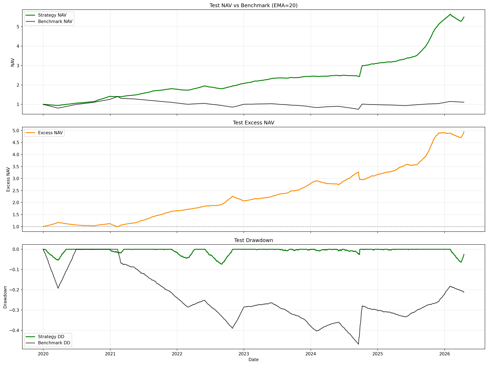

# ETF Sector Rotation Strategy | ETF 板块轮动策略

<p align="center">
  <a href="#zh"></a>
  <a href="#en"></a>
</p>

<p align="center">
  <a href="#1-项目概览">概览</a> •
  <a href="#3-回测结果">回测结果</a> •
  <a href="#6-快速开始">快速开始</a> •
  <a href="#11-策略来源与参考文献">引用与来源</a>
</p>

<a id="zh"></a>

## 简体中文

当前语言：中文 | [Switch to English](#en)

> 这是一个面向 A 股全市场 ETF（股票 / 行业 / 商品 / 红利 / 债券）的**低频、规则化、可复现**的周度板块轮动量化项目。  
> 策略在严格的训练集（2009-2016）与验证集（2017-2019）内完成参数搜索与防过拟合约束，并在 2020 年以来的真实样本外环境（OOS）中进行独立测试，展现了显著的超额收益与回撤控制能力。



> **样本外亮点（OOS: 2020–2026）**：Sharpe **1.48** · 年化 **35.25%** · 最大回撤 **-12.91%** · Calmar **2.73**。

### 1. 项目概览

在 A 股高度散户化和存量博弈的环境中，板块之间与风格内部（如新能源→半导体→红利→商品）的切换极快且分化剧烈。单一宽基 ETF 无法同时捕捉多条主线，而个股精选又面临极高的信息成本与非系统性风险。

本项目提出一个中间方案：**用规则化的 ETF 轮动模型捕捉中短期主线趋势**。

核心思想：
- 使用 **对数偏离度（LogBias）** 衡量价格相对中短期趋势的偏离水平，寻找爆发初期和中期的标的；
- 叠加 **Wilder RSI(14)** 和 **20日动量**，过滤早期弱趋势与假突破；
- 引入 **相对强弱（Relative Strength）**，过滤跑输沪深 300 基准的假动量；
- 通过 **周度调仓 + 日度风控 + 多档回撤收敛** 系统性管理组合换手与防守。

### 2. 策略逻辑

#### 2.1 截面评分框架

每日历经数据清洗后，对每只 ETF 构建以下多维因子：

| 因子 | 计算逻辑 | 交易含义 |
| --- | --- | --- |
| `LogBias` | `(log(close) - log(EMA(close, N))) * 100` | 对数偏离，正值表示上行趋势发散。最早由广发策略刘晨明提出用于刻画主线发散程度 |
| `LogBias slope` | `LogBias - LogBias.shift(5)` | 偏离斜率，刻画趋势是在加速还是衰退 |
| `RSI14` | Wilder RSI(14) | 动量强度与微观超买/超卖度量 |
| `ret_20` | 20 日收益 | 中期绝对动量 |
| `relative_strength` | `ret_20 - benchmark_ret_20` | 相对沪深 300 的横截面超额动量 |
| `rotation_score` | 如下加权打分公式 | 用于周度调仓时竞争前五大席位的综合排位分 |

综合打分（Rotation Score）：
```text
rotation_score = 0.4·LogBias + 0.2·LogBias_slope + 0.2·(ret_20 * 100) + 0.2·(relative_strength * 100) + 0.1·(RSI14 - 50)
```

#### 2.2 资金管理与执行

- **买入候选池**：包含“硬候选（趋势和强度全满足）”和“软候选（硬候选不足时的降级补位）”；
- **执行频率**：周五收盘后更新信号，**周一开盘价（加滑点）执行买入/卖出**；
- **仓位映射**：并非无脑满仓。候选标的数（0-5只）将映射至组合的总暴露度（如 `base / balanced / aggressive` 三档）；
- **回撤收敛网**：当策略净值较前高回撤触及 `dd_limit`（如 -24%、-28% 等）时，强制将最大暴露度压平至 `dd_cap`；
- **防守切换**：回撤达到 `defensive_trigger_dd` 后，容许将剩余额度投向债券 ETF 或现金池；
- **日内风控**：虽然周度轮动，但每日盘后检查 Hard-Exit（跌破支撑）与 Soft-Trim（涨幅过热），次日强制风控平仓。

### 3. 回测结果

在严格限定参数验证集最大回撤 `≤ 12%` 的前提下，样本外表现如下：

| 核心指标 | 训练集（2009–2019） | 样本外 OOS（2020–2026） | 沪深300（2020–2026） |
| --- | ---: | ---: | ---: |
| **年化收益** | 4.83% | **35.25%** | -0.8% |
| **Sharpe 比率** | 0.5423 | **1.4787** | - |
| **最大回撤** | -10.35% | **-12.91%** | ~ -45% |
| **Calmar 比率** | 0.47 | **2.73** | - |
| **胜率** | 44.60% | 45.67% | - |
| **平均持仓天数** | 12.8 | 12.4 | - |

*(注：扣除了单边 0.03% 手续费与单边 0.05% 滑点。完整指标表与交易流水见 `results/` 目录。)*

### 4. 仓库结构

```text
A-Share-ETF-Rotation-Strategy/
├─ strategy/     # Jupyter Notebook：最初的策略构思、研究笔记与实验草稿
├─ src/          # 工程化 Python 核心源码（配置 / 数据 / 信号 / 回测 / 寻优 / 管道）
├─ factor/       # 因子构建文档（LogBias、相对强弱的设计原理解析）
├─ backtest/     # 回测引擎机制说明（日度循环、对齐逻辑）
├─ figures/      # 回测期间生成的可视化图表
├─ results/      # [输出目录] 最佳参数对、指标对比表、净值曲线与交易日志
├─ report/       # 长文研究报告与幻灯片材料
└─ summary/      # One-pager 面试/快览总结
```

推荐阅读路径：`README.md` → `strategy/` → `src/` → `results/` → `figures/`

### 5. 核心流程

主入口管道封装于 `src/pipeline.py:main`：
1. `load_universe()`：由 Tushare 拉取 ETF 行情数据（自动降级至 AkShare，自带跳空修复与日期对齐）；
2. `optimize_params_on_training_set()`：使用并行计算在指定训练/验证集做局部网格寻优；
3. `run_backtest_on_period()`：分别在训练集、测试集应用最优参数执行日级别事件驱动回测；
4. `save_desktop_artifacts()`：输出净值序列、交易明细、最新候选标的与实盘下一日指令单。

### 6. 快速开始

#### 6.1 安装依赖

```bash
pip install -r requirements.txt
```

#### 6.2 设置 Tushare Token

当前项目严格遵守安全规范，**不会将 Token 硬编码在仓库中**。请在运行终端设置环境变量：

**Linux / macOS:**
```bash
export TUSHARE_TOKEN="your_tushare_pro_token"
python -m src.pipeline
```

**Windows PowerShell:**
```powershell
$env:TUSHARE_TOKEN="your_tushare_pro_token"
python -m src.pipeline
```

*(如未设置该变量，回测管道将完全降级并尝试通过 AkShare 爬取，但请求速度和稳定性受限。)*

#### 6.3 探索 Jupyter Notebook

包含交互式图表与因子探索：
```bash
jupyter notebook strategy/etf_sector_rotation_strategy.ipynb
```

#### 6.4 自动化每周信号推送

调仓信号触发逻辑已升级为：**每周最后一个 A 股交易日 17:00 后自动运行（非固定周五）**。此举自动规避了由于法定节假日造成的非工作日错位。

要验证当日是否应执行轮动并推送结果，请使用新增的入口脚本：

```bash
python scripts/send_weekly_signal.py
```

支持强制运行与模拟历史回测调仓通知：

```bash
python scripts/send_weekly_signal.py --date 2026-04-30 --force-run
```

当满足“本周最后一个交易日且时间 >= 17:00”条件时，脚本将自动拉取数据、进行计算，并通过 ServerChan (配置 `SERVERCHAN_SENDKEY` 环境变量) 将格式化好的换仓打分 Markdown 结果推送到您的微信终端。

### 7. 策略优势与特点

- **工程流水线完备**：覆盖从数据断点修复、除权对齐、因式组装到并行网格搜索的全链路；
- **输出面向实盘**：每次运行均会产出 `latest_buy_signal` (周度买入信号)、`latest_trade_plan` (包含日度平仓风控的指令明细) 以及直接可用的 `next_trade_holdings.csv`；
- **鲁棒的抗脆弱性**：验证集的强回撤约束使得策略在近三年的单边熊市中未发生大规模穿仓；
- **去拟合过滤**：使用行业+宽基的模糊聚类，不依赖单一标的的参数敏感性。

### 8. 现有局限性

- 早期 ETF 标的稀疏：部分热门细分行业（如电池、机器人）在 2020 年前未上市，导致训练集后半段才真正进入“板块大轮动”时代；
- 冲击成本简化：交易滑点设为固定万五，未建立基于日内流动性的价格冲击模型；
- 开盘模拟误差：周一开盘价成交无法精准反映极端跌停情况（如千股跌停无法卖出时的滞后损失）。

### 9. 后续优化方向

- **宏观开关（Regime Switching）**：引入社融脉冲、M1-M2 剪刀差、中债 10Y 利率作为顶层择时阀门；
- **目标波动率（Volatility Targeting）**：替代现有的硬性最高仓位设定，用已实现波动率逆向调节总杠杆；
- **高级执行模型（Execution Engine）**：接入 VWAP / TWAP 的拆单滑点模拟；
- **实盘接口对接**：对齐至开源交易终端（如 vnpy / qmt）进行小资金灰度测试。

### 10. 项目贡献声明

本策略代码从底层数据对齐到顶层框架均为手写构建，未依赖诸如 Backtrader / Zipline 等重型闭源/遗留框架，所有细节均保证了白盒透明，非常适合作为 A 股策略研究与二次开发的脚手架。

### 11. 策略来源与参考文献

本项目的定价因子与组合管理理论综合了多支量化体系，在此鸣谢：

1. **LogBias（乖离率 / 趋势偏离度）**：核心灵感源自前广发策略首席**刘晨明**在报告*《【广发策略】如何区分主线是调整还是终结？》*中首次提出的**主线乖离率**应用，通过比较指数收盘价与长短均线的距离来判定板块过热与衰退阶段。
2. **时间序列动量（Time-Series Momentum）**：Moskowitz, Ooi, & Pedersen (2012) *“Time Series Momentum”*, 奠定了中期绝对动量的交易合理性。
3. **相对强弱与板块轮动（Relative Strength Sector Rotation）**：Faber (2007) *“A Quantitative Approach to Tactical Asset Allocation”* 及 Gray & Vogel (2016) 的关于动量选股和风控结合的研究。
4. **Wilder's RSI**：J. Welles Wilder Jr. (1978) *“New Concepts in Technical Trading Systems”*。

### 12. 引用与开源许可

如果本项目对您的量化研究有帮助，欢迎引用：

```bibtex
@misc{etf-sector-rotation-2026,
  author = {Derick Hu},
  title  = {ETF Sector Rotation Strategy: LogBias + RSI with Weekly Rebalance on A-share ETF Universe},
  year   = {2026},
  url    = {https://github.com/<your-handle>/ETF-Sector-Rotation-Strategy}
}
```

本项目基于 [MIT License](LICENSE) 开源。

---

<a id="en"></a>

## English

Current language: English | [切换到中文](#zh)

> A low-frequency, rules-based, and reproducible weekly A-share ETF sector rotation quant project.
> Parameters are strictly tuned on train (2009-2016) / validation (2017-2019) splits with drawdown constraints, and evaluated on a dedicated out-of-sample (OOS) period from 2020 onward, demonstrating significant excess returns and drawdown management.

<p align="center">
  <a href="#1-overview">Overview</a> •
  <a href="#3-backtest-results">Results</a> •
  <a href="#6-quick-start">Quick Start</a> •
  <a href="#11-references--sources">References</a>
</p>


> **OOS Highlights (2020–2026)**: Sharpe **1.48** · Annualized **35.25%** · Max Drawdown **-12.91%** · Calmar **2.73**.

### 1. Overview

In the highly retail-driven and rapidly rotating A-share market, style switching (e.g., new energy → semiconductors → dividend → commodities) is brutal. A single broad-based ETF fails to capture shifting momentum, while discretionary stock picking faces high information costs.

This repository implements a middle ground: **a rule-based ETF rotation model designed to capture short-to-medium-term sector trends.**

Core philosophy:
- Utilize **LogBias** to measure price deviation against short/medium-term trends to identify early and mid-stage momentum bursts;
- Overlay **Wilder RSI(14)** and **20-day returns** to filter out weak trends and false breakouts;
- Introduce **Relative Strength** against the CSI 300 benchmark to prune fake momentum;
- Apply **weekly rebalancing + daily risk controls + multi-tier drawdown contraction** to systemically manage turnover and tail risk.

### 2. Strategy Logic

#### 2.1 Cross-Sectional Scoring Framework

After daily data cleansing, the following multi-dimensional factors are constructed for each ETF:

| Factor | Formula | Meaning |
| --- | --- | --- |
| `LogBias` | `(log(close) - log(EMA(close, N))) * 100` | Log deviation from trend. Originally proposed by Liu Chenming (GF Securities) to identify sector overheating. |
| `LogBias slope` | `LogBias - LogBias.shift(5)` | The acceleration or decay of the trend deviation |
| `RSI14` | Wilder RSI(14) | Micro-momentum strength and overbought/oversold indicator |
| `ret_20` | 20-day return | Absolute medium-term momentum |
| `relative_strength` | `ret_20 - benchmark_ret_20` | Cross-sectional excess momentum over CSI 300 |
| `rotation_score` | Weighted score (see below) | The ultimate rank score used to compete for the top 5 portfolio seats |

Composite ranking score:
```text
rotation_score = 0.4·LogBias + 0.2·LogBias_slope + 0.2·(ret_20 * 100) + 0.2·(relative_strength * 100) + 0.1·(RSI14 - 50)
```

#### 2.2 Portfolio Construction & Execution

- **Candidate Pool**: "Hard candidates" (meeting all trend/strength criteria) and "Soft candidates" (fallback options when hard candidates are scarce).
- **Execution Frequency**: Signals update after Friday's close; **execution occurs on Monday's open (with slippage)**.
- **Exposure Mapping**: The portfolio isn't always 100% invested. The number of eligible candidates (0 to 5) maps to specific total portfolio exposure limits (`base / balanced / aggressive` tiers).
- **Drawdown Contraction Grid**: When the live drawdown from the peak hits `dd_limit` (e.g., -24%, -28%), the maximum portfolio exposure is aggressively capped at `dd_cap`.
- **Defensive Switch**: If the drawdown exceeds `defensive_trigger_dd`, a portion of the portfolio is allowed to rotate into bond ETFs or cash.
- **Intraday Risk Control**: While rebalancing is weekly, daily post-market checks enforce Hard-Exits (price drops below support) and Soft-Trims (overheated momentum) to be executed the following morning.

### 3. Backtest Results

With a strict constraint limiting validation-set maximum drawdown to `≤ 12%`, the out-of-sample performance is as follows:

| Metric | Training (2009–2019) | OOS (2020–2026) | Benchmark CSI 300 (2020-2026) |
| --- | ---: | ---: | ---: |
| **Annual Return** | 4.83% | **35.25%** | -0.8% |
| **Sharpe Ratio** | 0.5423 | **1.4787** | - |
| **Max Drawdown** | -10.35% | **-12.91%** | ~ -45% |
| **Calmar Ratio** | 0.47 | **2.73** | - |
| **Win Rate** | 44.60% | 45.67% | - |
| **Avg Hold Days** | 12.8 | 12.4 | - |

*(Note: Results are net of 0.03% one-way commission and 0.05% one-way slippage. See `results/` for full trade logs and metric CSVs.)*

### 4. Repository Structure

```text
A-Share-ETF-Rotation-Strategy/
├─ strategy/     # Jupyter Notebooks: Original strategy ideation and research scratchpads
├─ src/          # Engineered Python core (config / data / signal / backtester / optimizer)
├─ factor/       # Factor documentation detailing LogBias and relative strength logic
├─ backtest/     # Details on the backtest engine mechanism (daily loop, calendar alignment)
├─ figures/      # Visualizations generated during the backtest
├─ results/      # [Output Dir] Optimal parameters, metrics, equity curves, and trade logs
├─ report/       # Long-form research reports and presentation materials
└─ summary/      # One-pager summaries
```

Recommended reading path: `README.md` → `strategy/` → `src/` → `results/` → `figures/`

### 5. Core Pipeline

The main entry point is encapsulated in `src/pipeline.py:main`:
1. `load_universe()`: Fetches ETF market data from Tushare (with automatic fallback to AkShare, handling price jump repairs and calendar alignments).
2. `optimize_params_on_training_set()`: Performs localized grid search on train/validation sets using parallel processing.
3. `run_backtest_on_period()`: Executes event-driven daily backtests across training and testing sets using the optimal parameters.
4. `save_desktop_artifacts()`: Exports NAV series, trade details, latest candidates, and live execution orders for the next trading day.

### 6. Quick Start

#### 6.1 Install Dependencies

```bash
pip install -r requirements.txt
```

#### 6.2 Set Tushare Token

For security, **no tokens are hardcoded in the repository**. Please set your Tushare token via environment variables in your terminal:

**Linux / macOS:**
```bash
export TUSHARE_TOKEN="your_tushare_pro_token"
python -m src.pipeline
```

**Windows PowerShell:**
```powershell
$env:TUSHARE_TOKEN="your_tushare_pro_token"
python -m src.pipeline
```

*(Without the token, the pipeline will degrade and attempt to scrape via AkShare, which is significantly slower and less stable.)*

#### 6.3 Explore via Jupyter Notebook

Includes interactive charts and factor exploration:
```bash
jupyter notebook strategy/etf_sector_rotation_strategy.ipynb
```

#### 6.4 Automated Weekly Signal Push

The signal trigger logic has been upgraded: **it now automatically runs after 17:00 on the last A-share trading day of the week (no longer fixed to Friday)**. This smartly navigates holiday-shortened weeks without missing rotation windows.

To verify whether a rotation should execute today and push the results, use the new entry script:

```bash
python scripts/send_weekly_signal.py
```

It also supports back-testing historical signals and forced execution:

```bash
python scripts/send_weekly_signal.py --date 2026-04-30 --force-run
```

When the condition "Last Trading Day of the Week AND time >= 17:00" is met, the script fetches data, computes signals, and pushes the formatted Markdown results to your WeChat via ServerChan (requires `SERVERCHAN_SENDKEY` env variable).

### 7. Strategic Advantages & Highlights

- **Complete Engineering Pipeline**: Covers the entire workflow from handling data anomalies and corporate actions to parallel grid searching.
- **Live-Trading Ready Outputs**: Every execution generates `latest_buy_signal` (weekly buys), `latest_trade_plan` (daily risk trims), and a ready-to-use `next_trade_holdings.csv`.
- **Robust Anti-Fragility**: The strict validation-set drawdown constraint prevented massive capitulation during the severe A-share bear market of recent years.
- **De-fitted Filters**: Utilizes fuzzy clustering across broad and sector ETFs rather than relying on hyper-sensitive parameters of single tickers.

### 8. Current Limitations

- **Sparse Early Data**: Many popular niche sector ETFs (e.g., batteries, robotics) were not listed prior to 2020, making the early training set less representative of modern rotation dynamics.
- **Simplified Impact Costs**: Trading slippage is fixed at 5 basis points. A granular model based on intraday liquidity and market impact is not yet implemented.
- **Execution Price Accuracy**: Executing strictly at Monday's open fails to precisely capture the reality of extreme limit-down situations where liquidity dries up.

### 9. Future Optimizations

- **Macro Regime Switching**: Incorporate credit impulse (Total Social Financing), M1-M2 scissors difference, and 10Y CGB yields as top-level timing valves.
- **Volatility Targeting**: Replace hard exposure caps with inverse total-leverage adjustments based on realized volatility.
- **Execution Engine**: Integrate VWAP / TWAP order-splitting algorithms to better simulate slippage.
- **Live Paper Trading**: Hook the output into open-source trading terminals (e.g., vnpy / qmt) for small-capital forward testing.

### 10. Contribution Statement

This strategy codebase—from data alignment to the top-level backtest engine—is entirely custom-built. It intentionally avoids heavy, legacy, closed-source frameworks like Backtrader or Zipline, ensuring full white-box transparency. It serves as an excellent scaffold for A-share quant research and secondary development.

### 11. References & Sources

The pricing factors and portfolio management theories in this project synthesize multiple quantitative frameworks. Special thanks to:

1. **LogBias (Trend Deviation Rate)**: Core inspiration originates from **Liu Chenming** (former Chief Strategist at GF Securities) in the report *"GF Strategy: How to Distinguish Whether a Main Theme is Adjusting or Ending?"*. He first proposed using "main theme deviation rates" (the distance between index close and long/short moving averages) to identify sector overheating and exhaustion.
2. **Time-Series Momentum**: Moskowitz, Ooi, & Pedersen (2012) *"Time Series Momentum"*, which established the trading validity of medium-term absolute momentum.
3. **Relative Strength and Sector Rotation**: Faber (2007) *"A Quantitative Approach to Tactical Asset Allocation"* and Gray & Vogel (2016) regarding the combination of momentum stock selection and risk control.
4. **Wilder's RSI**: J. Welles Wilder Jr. (1978) *"New Concepts in Technical Trading Systems"*.

### 12. Citation & License

If this repository aids your quantitative research, please consider citing:

```bibtex
@misc{etf-sector-rotation-2026,
  author = {Derick Hu},
  title  = {ETF Sector Rotation Strategy: LogBias + RSI with Weekly Rebalance on A-share ETF Universe},
  year   = {2026},
  url    = {https://github.com/<your-handle>/ETF-Sector-Rotation-Strategy}
}
```

This project is open-sourced under the [MIT License](LICENSE).

